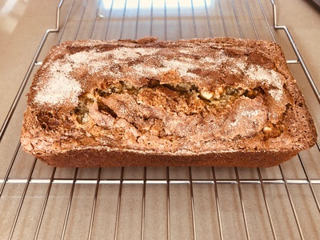

# Banana Bread

*Synopsis:* A cinnamon-flavoured quick bread with bananas and waluts.

<!-- TODO:  -->

## Ingredients

### Batter

- 2 c. white all-purpose flour (256g, 9oz)
- 1/2 tsp. baking soda
- 2 tsp. baking powder
- 1/4 tsp. salt
- 1 tsp. ground cinnamon
- 1/4 c. chopped walnuts (optional; 50g dry weight)

- 1/2 c. butter (alt: 1 c. shortening + 6 tbsp. water)
- 1/2 c. white sugar (100g, 3.55oz)
- 1/4 c. packed brown sugar (55g, 1.9oz)
- 1/4 tsp. vanilla extract
- 1 egg

- 1 to 1.5 c. banana (typically: 2 or 3 bananas)
- 1/3 c. buttermilk (alt: 1 tbsp. cream + 1/4 c. milk + 1 tsp. lemon juice)
- 1 tbsp. sour cream (optional)

### Topping

- 1/2 tsp. ground cinnamon
- 2 tbsp. white sugar

## Preparation

- Sift flour, baking soda, baking powder, salt, and cinnamon and set aside.
  Mix in walnuts (after sifting) if including them in the recipe.

- Combine cinnamon and sugar for topping and set aside.

- Mash banana thoroughly with buttermilk (and sour cream) and set aside.

- Cream butter and sugar well, then beat in egg and vanilla extract.

- Add flour and banana alternately into the creamed butter, mix until smooth.

## Assembly & Baking

- Pour batter into a (greased) 9×5 loaf pan and level.
- Sprinkle topping evenly over the batter.
- Bake 350°F 45–60 min.

## Notes

- 2 or 3 typical bananas is fine for a single loaf; I prefer the texture with 3.
  At 4 or more, you should split the recipe.
