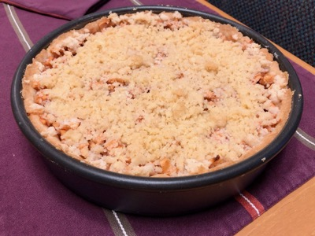

# German Apple Cake

Recipe from: Josefine Spies

*Synopsis:* A crumble-top apple tart with cinnamon.

## Ingredients

### Dough

- 1 1/2 c. flour
- 1/2 tsp. baking powder
- 1/3 c. sugar
- 1 egg
- 1 stick butter
- dash of salt

### Filling

- 4 or 5 good-sized apples.
- juice of 1 lemon, 1-2 tbsp.
- 1 tsp. cinnamon
- 2 tbsp. white sugar.

### Topping

-  1/2 c. flour
-  1/4 c. sugar
-  1/4 c. butter or margarine

## Preparation

### Dough

-  Mix together all ingredients with hands to make a flexible dough.

-  Form into a ball and roll out flat, around .5 cm (1/4 in.) thick.

-  Press into either a 9 in. round cake pan or round baking dish to form a
   shell. Be sure the dough covers the bottom and sides completely.

### Filling

-  Cut apples into small chunks in a bowl.
-  Combine cinnamon and sugar.
-  Add lemon juice and cinnamon-sugar mix to apples.
-  Stir gently to combine, and set aside.

### Topping

-  Work ingredients together with your hands until it all sticks together.

## Assembly & Baking

-  Prepare dough, filling, and topping as described.
-  [optional] Brush the inside of the crust with melted butter.
-  Pour the apple mixture into the shell.
-  Crumble the topping over the top of the apple mixture.
-  Bake at 325°F for 45 minutes or until apples are tender and topping golden.

## Notes

*  For a crisper, sweeter crust, add a bit more sugar, by the amount of a
   heaping measure.
