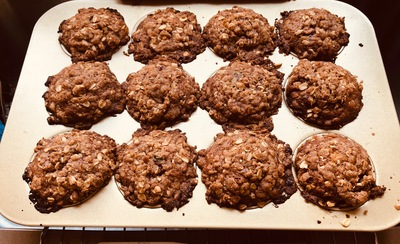

# Raspberry Muffins

Recipe from: Mary Ann Milanese, head baker at Collis Dining, Dartmouth College,
Hanover, New Hampshire. Adapted to small batches by M. J. Fromberger.

*Synopsis:* Sweet muffins with whole raspberries.

<!-- Images should be 400px wide -->
<!-- TODO:  -->

## Ingredients

### Batter

- 1 1/2 c. white all-purpose flour (192g)
- 1/4 tsp. salt
- 1 tsp. baking soda
- 2 tsp. baking powder
- 1/2 c. steel-cut or quick oats
- 1/2 c. chopped walnuts (optional)
- 1/2 c. packed brown sugar
- 2 eggs
- 1/2 c. buttermilk
- 1/2 c. vegetable oil
- 1 c. whole raspberries (frozen is OK)

### Topping

- 1/4 c. butter
- 1/4 c. packed brown sugar
- 1/4 c. steel-cut or quick oats
- 1/4 c. white all-purpose flour
- 1 tsp. ground cinnamon

## Preparation

### Batter

- Combine flour, oats, (walnuts), salt, baking powder, baking soda, and brown
  sugar.

- Mix in eggs, buttermilk, and oil to form a batter.

- Fold in raspberries gently at the end, to avoid breakage and discolouring the
  batter.

### Topping

- Mash together all ingredients loosely to form a rumble.

## Assembly & Baking

- Pour batter into muffin tins by 1/4 or 1/2 c. measure. Tins should be full and clean.
- Crumble topping evenly over all muffins.
- Bake at 400°F for 15–20 min.

## Notes

- Typically makes 10 to 12 muffins, depending on tin size.
