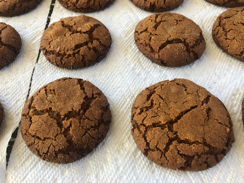

# Ginger Cookies

Recipe from: Alissa McFarlin

*Synopsis:* Sugared molasses cookies with minced crystallized ginger

## Ingredients

### Base

-  6 tbsp. butter or margarine
-  1/3 c. white sugar
-  1/4 c. molasses
-  1 large egg

### Ginger

-  1/2 c. crystallized ginger (85 to 90g)
-  1/3 c. white sugar

### Dry

-  2 c.	flour (256g)
-  2 tsp. baking soda
-  3/4 tsp.	ground cinnamon
-  1/2 tsp. ground nutmeg
-  2 tbsp. white sugar (for rolling)

## Preparation

-  Chop ginger and macerate in 1/3 c. of sugar.
-  Cream together butter and 1/3 c. of sugar, and beat until fluffy.
-  Fold ginger, molasses, and egg, and mix well.
-  In a separate bowl, mix flour, baking soda, cinnamon, and nutmeg.
-  Fold dry ingredients gradually into the wet base.
-  Cover dough and chill for at least 1 hour (overnight is fine).

## Assembly & Baking

-  Shape dough into spherical balls.
-  Roll each ball in white sugar
-  Place sugared spheres 2–3 inches apart on a greased or nonstick baking sheet.
-  Bake at 350°F for 10–12 minutes.

## Notes

*  In our current oven as of Dec 2020, bake for 11 minutes.

*  If you prefer chewy cookies, err toward less baking time.

*  Treat ginger as a limiting reagent and decide how many batches to make based
   on that. Chop it up and see how much you have.

*  To obtain a vegan recipe, replace egg with 1/4 c. applesauce and use vegan
   margarine in place of butter.
