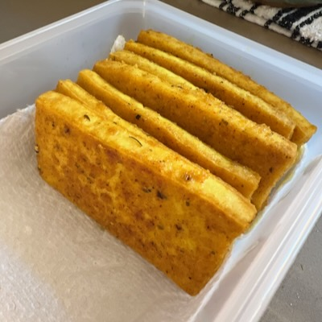

# Tofu Planks

*Synopsis:* Pan-fried lightly spiced and breaded tofu planks.

## Ingredients

-  1 lb. (453g) block firm or extra-firm tofu
-  1/2 tsp. salt
-  1/2 tsp. ground chili powder
-  1/2 tsp. ground turmeric
-  1/2 tsp. ground cumin
-  1/2 tsp. garlic powder (optional)
-  3 tbsp. white flour
-  1 tbsp. plain bread crumbs
-  ground black pepper to taste
-  1/8 tsp. ground cayenne pepper (optional)

## Preparation

### Breading

In a mixing bowl, combine the flour, bread crumbs, all dry spices, and mix well.

### Tofu

**Optional but recommended:** A few days ahead of time, freeze the package of
tofu, and allow it to defrost fully in the refrigerator before beginning the
steps below. Freezing results in a greatly improved texture.

-  Drain the tofu and press out excess water. Press firmly, but not so hard as
   to crush the structure of the block.

-  Slice the block into "planks" around 1/2 cm. thick. Do not slice them so
   thin that they crumble, better to err on the side of thicker.

-  Dredge each plank in the breading mixture till well-coated, then set aside.

## Cooking

-  Heat a frying pan over medium-high heat generously dosed with cooking oil.
   The temperature should be high enough to sizzle but not to scorch.

-  Lay the planks in the pan and allow them to fry, rotating occasionally to
   cook evenly, then flip and repeat this step for the other side.

## Use & Storage

Expect to get up to 12 or 13 planks from a single brick; thinner than that and
the planks are likely to fall apart during preparation. Err on the side of
thicker if you're not sure.

Allow the cooked planks to cool. The results are best eaten fresh, nice and
crispy, but they will keep in a closed container in the refrigerator for up to
a week. They are good eaten cold or reheated, or cut up in other recipes.  They
will not remain crispy after refrigeration, but can be toasted to restore them.

## Notes

*  Substitute other spices as you see fit.  I sometimes replace the ground
   cumin with ground ginger, for example. Ground Hungarian paprika is also
   nice.

*  I use olive oil mixed with some sesame oil for cooking, but sunflower or
   canola oil also work fine.
